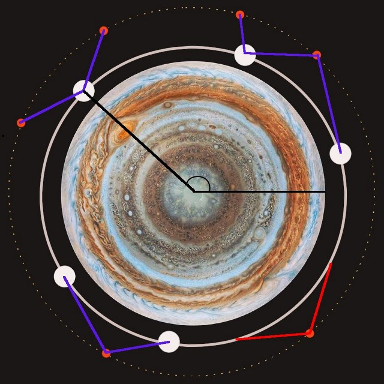
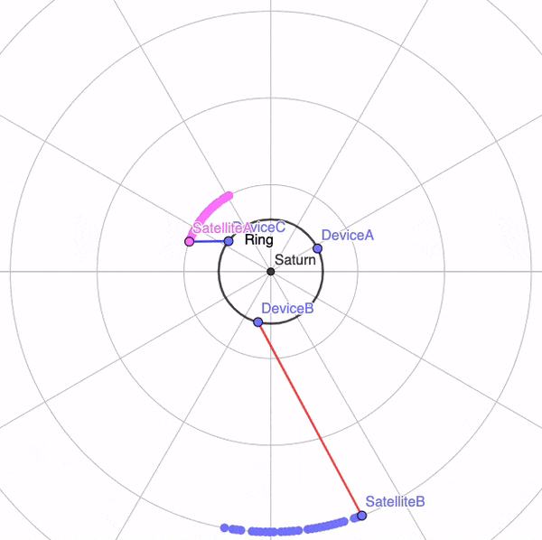

# COMP2511 Assignment: Back in Blackout

> [Draft – V1]

> Due: [TBA]

Value: 20 marks (see course outline for more details)

## Aims

- Practice applying a systematic approach to object-oriented design process
- Gain experience in implementing an object-oriented program with multiple interacting classes
- Gain hands on experience with Java libraries and JSON

## Preamble and Problem

So much of today's technology uses Global Positioning System (GPS) information, for example, tasks such as tagging photographs with the location where they were taken, guiding drivers with car navigation systems, and even missile control systems. There are currently 31 active GPS satellites orbiting the Earth all together providing near-constant GPS coverage.

Society has advanced far in this alternate universe; we have now started to occupy the rings of Jupiter (the Jovian ring system). However, to remain connected with the rest of the universe they still rely on GPS satellites! These GPS connections are not free and four major entities exist in rivalry over the profits: SpaceX, Blue Origin, NASA (National Aeronautics and Space Administration), and Soviet Satellites.

Firstly, you will set up a very simplified simulation of the ring and its rotating satellites. Next, you will be running this simulation to figure out how much each Satellite makes over a timestep (as the simulation runs).

You will need to develop, design, and implement an object-oriented approach that utilises concepts such as abstraction, encapsulation, composition, and inheritance as taught in lectures.

## Assumptions

To do this, we are going to have to make some assumptions. We will assume that:

- We will only look at a single ring.
- The ring is hollow.
- Its radius is 3000 kilometres (`r`).
- The ring does not rotate.
- We will represent all positions through their angle `θ`.
- The satellites orbit around the disk in 2D space.

To help you visualise the problem the image below and gif beside it may be useful.

<table>
<tr>
</tr>
<tr>
<td>



</td>
<td>



</td>
</tr>
</table>

In the image:

- The satellites are denoted as the orange circles on the border, for simplicity they are all at the same height though in reality (as shown in the gif) they can be at different heights.
- The devices are the large white circles on the ring.
- The purple lines show successful connections (notice how they do not cross the white ring). A device can typically only have one connection with satellites being capable of multiple.
- The red lines show how one of the satellites can make no connections to any of the nearby devices since the straight line to that satellite would cross the ring.

At any given point in time, a device can connect to a satellite if it is visible to the satellite. For a satellite to be visible to the device, the line between the device and the satellite needs to not cross the centre of the ring. This line can cross through other satellites though.

## Requirements

> You will not be solving ANY math here; we will be providing a small library that solves all the mathematical details of this problem.

There are three tasks:

1. Implement the 'world state', you'll be adding/moving devices, adding/removing satellites, and printing out where objects are in the world, you WON'T be simulating them yet.
2. Implement activation periods (where devices try to connect to satellites) and simulating the 'world state' i.e. moving the satellites around.
3. Implement special devices.

### Devices

- `Handheld` – phones, GPS devices, tablets.
  - Handhelds take 1 minute to connect
- `Laptop` – laptop computers.
  - Laptops take 2 minutes to connect
- `Desktop` – desktop computers and servers.
  - Desktops take 5 minutes to connect

### Satellites

- `SpaceXSatellite`
  - Orbits at a speed of 3.33 degrees per hour
  - Only connect to handheld devices
  - Infinite number of connections
  - Devices connect instantly
- `BlueOriginSatellite`
  - Orbits at a speed of 8.5 degrees per hour
  - Supports all devices
  - Maximum of 5 laptops and 2 desktops at a time with no limit on handheld devices, however the absolute maximum of all devices at any time is 10.
  - i.e. you can have 3 laptops, 1 desktop, and 6 handhelds (3 + 1 + 6 = 10) but you can't have 3 laptops, 1 desktop, and 7 handhelds (3 + 1 + 7 = 11).
- `NasaSatellite`
  - Orbit at a speed of 5.1 degrees per hour.
  - Supports all devices
  - All devices take 10 minutes to connect (regardless of device)
  - Maximum of 6 devices (of any type)
    - Once it reaches this maximum if there are any devices in the region [30°, 40°] (inclusive) it will prioritise those devices and will drop the oldest connection that is outside of that region, if there are no connections outside that region then it can't connect.
- `SovietSatellite`
  - Oribts at a speed of 60 degrees per hour.
  - Connect to only laptops and desktops which take 2 times as long to connect
  - Will only orbit the region of [140°, 190°] (inclusive) and once it reaches the border of that region will reverse. SovietSatellites cannot be created outside this region.
    - To make this simpler you'll notice that it travels 1 degree per minute (your simulation will run at one minute intervals) this means that you don't have to worry about handling what happens when you 'overshoot' the boundaries.
    - Note connections can be made outside that region, none of the logic here restricts that.
  - Starts in a anti-clockwise direction (i.e., positive direction)
  - Maximum of 9 devices but will always accept new connections by dropping the oldest connection.

## Visualisation

These problems can be hard to visualise! We however, have created a very nice visualisation tool, you can see it [here](https://cgi.cse.unsw.edu.au/~z5204996/Comp2511/assignment_development/UI/app.py). This tool lets you give it any world state (outputted typically by showWorldState but can also be hand crafted) and will let you simulate it in segments of a day at a time, you'll see the satellites moving around, you'll see connections being formed and just the general movement of systems. It runs on a sample solution so you can refer to this for behaviour! You'll notice that in this world satellites actually move pretty slowly (comparative to the real world), this is mainly just so tests are easier to write and it's easier to watch them move around (rather than completing multiple rotations in a day and just zooming around the ring!).

## Task 1 (World State)

> This task is mainly focused on models, you’ll be writing around 200-300 lines to complete task 1 with a lot of it being boilerplate code (i.e. class definitions).

If you make your UML initially, you’ll find this task a whole lot easier since it’ll be mostly just copying down the UML to Java.

### Task 1 a) Create Device

Adds a device to the ring at the position specified, the position is measured in degrees relative to the x-axis, rotating anti-clockwise.

<table>
<tr>
<th>Json</th>
<th>Console</th>
</tr>
<tr>
<td>

```json
{
    "command": "createDevice",
    "id": <String>,
    "type": <String>,
    "position": <double>
}
```

</td>
<td>

```
> createDevice <type: String> <id: String> <position: double>
```

</td>
</tr>
</table>

#### Examples

<table>
<tr>
<th>Json</th>
<th>Console</th>
</tr>
<tr>
<td>

```json
{
  "command": "createDevice",
  "id": "MyDevice",
  "type": "DesktopDevice",
  "position": 10.4
}
```

</td>
<td>

```
> createDevice DesktopDevice MyDevice 10.4
```

</td>
</tr>
</table>

### Task 1 b) Move Device

Moves a device (specified by id) to a new position (measured in degrees from x axis counter clockwise / anti-clockwise).

<table>
<tr>
<th>Json</th>
<th>Console</th>
</tr>
<tr>
<td>

```json
{
    "command": "moveDevice",
    "id": <String>,
    "newPosition": <double>
}
```

</td>
<td>

```
> moveDevice <id: String> <newPosition: double>
```

</td>
</tr>
</table>

#### Examples

<table>
<tr>
<th>Json</th>
<th>Console</th>
</tr>
<tr>
<td>

```json
{
  "command": "moveDevice",
  "id": "MyDevice",
  "position": 109.92
}
```

</td>
<td>

```
> moveDevice MyDevice 109.92
```

</td>
</tr>
</table>

### Task 1 b) Remove Device

Removes a device (specified by id).

<table>
<tr>
<th>Json</th>
<th>Console</th>
</tr>
<tr>
<td>

```json
{
    "command": "removeDevice",
    "id": <String>
}
```

</td>
<td>

```
> moveDevice <id: String>
```

</td>
</tr>
</table>

#### Examples

<table>
<tr>
<th>Json</th>
<th>Console</th>
</tr>
<tr>
<td>

```json
{
  "command": "removeDevice",
  "id": "MyDevice"
}
```

</td>
<td>

```
> removeDevice MyDevice
```

</td>
</tr>
</table>

### Task 1 d) Create Satellite

Creates a satellite (specified by id) at a given height (measured from centre of planet, so it’ll include the radius of the ring) at a given position (specified in degrees measured counter clockwise from the x-axis), travelling at a given angular velocity (degrees per second) as shown in the image below.

<table>
<tr>
<th>Json</th>
<th>Console</th>
</tr>
<tr>
<td>

```json
{
    "command": "createSatellite",
    "id": <String>,
    "type": <String>,
    "height": <double>,
    "position": <double>
}
```

</td>
<td>

```
> createSatellite <type: String> <id: string> <height: double> <position: double>
```

</td>
</tr>
</table>

#### Examples

<table>
<tr>
<th>Json</th>
<th>Console</th>
</tr>
<tr>
<td>

```json
{
  "command": "createSatellite",
  "id": "MySatellite",
  "type": "NasaSatellite",
  "height": 5000,
  "position": 43.2
}
```

</td>
<td>

```
> createSatellite NasaSatellite MySatellite 5000 43.2
```

</td>
</tr>
</table>

### Task 1 e) Remove Satellite

Removes a satellite (specified by an id) from the world. Should disconnect all connected devices.

<table>
<tr>
<th>Json</th>
<th>Console</th>
</tr>
<tr>
<td>

```json
{
    "command": "removeSatellite",
    "id": <String>
}
```

</td>
<td>

```
> removeSatellite <id: string>
```

</td>
</tr>
</table>

#### Examples

<table>
<tr>
<th>Json</th>
<th>Console</th>
</tr>
<tr>
<td>

```json
{
  "command": "removeSatellite",
  "id": "MySatellite"
}
```

</td>
<td>

```
> removeSatellite MySatellite
```

</td>
</tr>
</table>

### Task 1 f) Show World State

Lists all satellites and devices that currently exist in the world. Satellites will show their existing `connections` and devices will show their `activationPeriods` (note that until Task 2 is completed, these will be an empty array).

The world state will also need to display an array of `possibleConnections` for each satellite; that is, devices that can connect to the satellite at the current point in time. A device can connect to a satellite if Jupiter is not obstructing the line of sight joining them. We have provided a maths class that does this logic for you - note that it's a static method so you don't need an instance to use it. You call it using `MathsHelper.satelliteIsVisibleFromDevice(satelliteAngle, satelliteHeight, deviceAngle)`.

NOTE: `possibleConnections` is **PURELY** based on whether or not the device is of the right type (i.e. SpaceX can only connect to handhelds) and is within range, it won't incorporate the more complicated sides of this assignment such as capacity/activation periods.

The `satellites` and `devices`, ordered by their ID alphabetically. The `possibleConnections` arrays should be in alphabetical order. All floating point numbers should be rounded to 4 decimal places for output.

<table>
<tr>
<th>Json</th>
<th>Console</th>
</tr>
<tr>
<td>

```json
{
  "command": "showWorldState"
}
```

</td>
<td>

```
> showWorldState
```

</td>
</tr>
</table>

#### Output

Should print out a JSON array (can use any indent level but recommended to use `.toString(2)` on a JsonArray to make it use 2 spaces of indent which is a nice balance between readability and brevity).

Example Output (for both Console and JSON)

```json
{
  "satellites": [
    {
      "id": "Loki",
      "position": 0,
      "velocity": 0.0555,
      "possibleConnections": ["LokisPhone"],
      "type": "SpaceXSatellite",
      "connections": [],
      "height": 100000
    }
  ],
  "devices": [
    {
      "id": "GitLabServers",
      "isConnected": false,
      "position": 0.3,
      "activationPeriods": [],
      "type": "DesktopDevice"
    },

    {
      "id": "LokisPhone",
      "isConnected": false,
      "position": 0,
      "activationPeriods": [],
      "type": "HandheldDevice"
    }
  ]
}
```

## Task 2 (Simulation)

The second tasks involves the actual simluating of the movement of satellites and the scheduling of connections.

### Task 2 a) Schedule Device Activation

Activates the specified device for a given period of time.

<table>
<tr>
<th>Json</th>
<th>Console</th>
</tr>
<tr>
<td>

```json
{
    "command": "scheduleDeviceActivation",
    "deviceId": <String>,
    "startTime": <Time>,
    "durationInMinutes": <int>
}
```

</td>
<td>

```
> scheduleDeviceActivation <deviceId: string> <start: Time> <durationInMinutes: Integer>
```

</td>
</tr>
</table>

#### Examples

<table>
<tr>
<th>Json</th>
<th>Console</th>
</tr>
<tr>
<td>

```json
{
  "command": "scheduleDeviceActivation",
  "deviceId": "LokisPhone",
  "startTime": "07:00",
  "durationInMinutes": 200
}
```

</td>
<td>

```
> scheduleDeviceActivation LokisPhone 07:00 200
```

</td>
</tr>
</table>

The `connections` for any given satellite should be ordered by `startTime`, then by `deviceId`.

### Task 2 b) Run the Simulation

You will need to simulate the movement of the satellites and connection of devices to satellites, based on whether the devices are activated and visible. You will need to simulate their movements in increments of 1 minute, and are given the number of minutes to simulate for.

<table>
<tr>
<th>Json</th>
<th>Console</th>
</tr>
<tr>
<td>

```json
{
  "command": "simulate",
  "durationInMinutes": <int>
}
```

</td>
<td>

```
> simulate <durationInMinutes: Integer>
```

</td>
</tr>
</table>

#### Examples

<table>
<tr>
<th>Json</th>
<th>Console</th>
</tr>
<tr>
<td>

```json
{
  "command": "simulate",
  "durationInMinutes": 340
}
```

</td>
<td>

```
> simulate 340
```

</td>
</tr>
</table>

> An example output of this is as follows... you can see the exact sequence of commands that creates this in Task 2 Example (a little further down).

```json
{
  "satellites": [
    {
      "id": "Satellite1",
      "position": 344.25,
      "velocity": 85,
      // these are all the 'possible' connections you *could* have to this device!
      // these are purely based on whether or not the device is in range and of the right type
      "possibleConnections": ["DeviceA", "DeviceC"],
      "type": "NasaSatellite",
      "connections": [
        // the actual connections you have!
        {
          "minutesActive": 390,
          "satelliteId": "Satellite1",
          "startTime": "00:00",
          "endTime": "06:41",
          "deviceId": "DeviceA"
        },
        {
          // the reason why this isn't '70' is because our currentTime is 8:20
          // (as you can see in the next object just a couple lines down)
          // which means we haven't actually processed the 'minute' for 8:20 yet
          // we are just *up* to 8:20!!
          "minutesActive": 69,
          "satelliteId": "Satellite1",
          "startTime": "07:00",
          "endTime": null,
          "deviceId": "DeviceC"
        }
      ],
      "height": 10000
    }
  ],
  "currentTime": "08:20",
  "devices": [
    {
      "isConnected": false,
      "id": "DeviceA",
      "position": 30,
      "activationPeriods": [{ "startTime": "00:00", "endTime": "06:40" }],
      "type": "HandheldDevice"
    },
    {
      "isConnected": false,
      "id": "DeviceB",
      "position": 180,
      "activationPeriods": [],
      "type": "LaptopDevice"
    },
    {
      "isConnected": true,
      "id": "DeviceC",
      "position": 330,
      "activationPeriods": [{ "startTime": "07:00", "endTime": "12:00" }],
      "type": "DesktopDevice"
    }
  ]
}
```

You should use the following pseudocode for updating positions and checking for visibility when running your simulation.

```
for each step of the simulation:
    update the position of each satellite
    then process connections/disconnections
```

> HINT: The order of this matters - you want to move every satellite first, then process connections/disconnections, it'll make a lot of the logic simpler.

After running the `simulate` command, the world state should reflect the updated locations of satellites and their existing connections.

## Task 3 (Specialised Devices)

For this task, you will need to add two new specialised types of devices:

- (Handheld) MobileX Phones will prioritise connection to a SpaceX satellite if it is in range over any other satellite.
- (Desktop) AWS (Amazon Web Services) Cloud Servers require 2 connections at any time (to 2 different satellites) if they can only maintain one connection, they will close that connection.

These are created like any other device, specifying `"MobileXPhone"` and `"AWSCloudServer"` respectively as the type.

## Other Requirements

- When showing the world state, satellites and devices are sorted in alphabetical order
- The order of JSON keys within a JSON object *doesn't* matter i.e. `{ "a": 1, "b": 2 }` is accepted and so is `{ "b": 2, "a": 1 }`.  HOWEVER, the order of arrays *does* matter!  Make sure you order them correctly.
- The device activation start/end times are inclusive; so if a device is connectable to a satellite and is activated from `10:00` to `10:30`, the connection will start at `10:00` and end at `10:30`, the duration in minutes would be 30 minutes.
  - Furthermore, make sure to incorporate the device connection times correctly! Device connection times are specified on both satellites & devices (with various modifiers). Device start times _include_ the time spend connecting **but** the `minutesActive` does not for example if it took 10 minutes to connect (in the example of `10:00` to `10:30`) the start time would be `10:00`, end time would be `10:30` but `minutesActive` would be `20` (not `30`!). Note: MinutesActive should ALWAYS reflect the minutes the connection has been active even if the connection has not _yet_ been disconnected.
- ALL device ids are alphanumeric i.e. they consist of just alphabet characters and digits i.e. `A-Z`, `a-z`, `0-9`, or `_`.
- All floating point (double) values only have to be accurate to a precision of 0.01. i.e. `3.334` and `3.339` are both 'equal' in any test we'll be running. You do _NOT_ need to worry about rounding/formatting them in your code just print out the doubles that you have!
- Devices disconnect from satellites instantly.
- The time it takes for a device to connect to a satellite is not included in the period of time in which it is classified as connected
- 2 devices cannot occupy the same slot (but there is nothing stopping putting a device at 4.5 degrees and another at 4.51 degrees).
- Once connected, devices STAY connected until out of range or the device's activation ends.
- All satellites travel anti-clockwise (exception being Soviet Satellites which can travel in both directions) angles are measured from the x-axis, so this means their angle should 'increase' over time.
  - You should ONLY refer to positions in the range `[0, 360)` that is any value that is any value `>= 360` should be wrapped back around i.e. 360 = 0, 361 = 1, 390 = 30, 720 = 0, ...
- Devices connect to satellites based on the following priority (top to bottom).
  - Satellites which are closer. Distances can be considered equal if they are less than 0.01
  - If two satellites are equal distance apart then prefer satellites that are to the right of the device over ones to the left. That is satellites with a ‘smaller’ angle, this is because these satellites have just entered our range and will give us the longest access.
  - If somehow two satellites occupy the same position then choose the one with the lower height
  - We will never give you two satellies that occupy the same position (thus be the same distance apart) that'll also occupy the same height, however feel free to choose based upon Lexiographical Order (i.e. alphabetical order: `'ABC' < 'BCD'`)
  - We will never move or remove a device while it is connected to a satellite.

## Testing, Coverage and Dryruns

The following are example use cases of Tasks 1 and 2. These are set up to run against your code in the `src/test` directory and are the dryrun for this assignment.

You will need to write your own additional tests. The `TestHelper.java` and `ResponseHelper.java` files will allow you to generate tests in the same fashion as the provided ones.

Test testing infrastructure will be asserting what is printed to `stdout` meaning that you won't be able to debug using normal print statements. You can use `System.err.println` for debugging `print` statements instead. The way this works is pretty simple but maybe a bit obscure if you've not taken 1531.

Effectively `System.out.println` (and `printf` / friends) all write to a special 'file descriptor' `stdout` this points to typically some sort of device / handle that will result in the output showing on your terminal. We capture all this stdout output and use it to 'assert' things in the tests, this is quite cool (maybe a bit complex) and definitely a recommendation is to read through TestHelper (you don't _need_ to understand it, but it's useful to atleast grasp why it does what it does). However, this means that if you want debugging printfs you _can't_ use stdout, you instead need to use stderr! This is actually quite a common industry pattern of using stderr's for logs/debug outputs.

To run coverage checking you'll need gradle installed! Easiest way is to follow the following guide:

- Download the zip file from (download should start automatically): [https://gradle.org/next-steps/?version=5.4.1&format=bin](https://gradle.org/next-steps/?version=5.4.1&format=bin)

You should follow the installation instructions provided: [https://gradle.org/install/#manually](https://gradle.org/install/#manually)

For Linux users, note that you may have to edit the ~/.bashrc file to permanently change the PATH variable by appending the line:
export PATH=$PATH:/opt/gradle/gradle-5.4.1/bin

Note that Gradle 5.4.1 is the same version as on CSE machines. It has been chosen so that common syntax can be used for the test.gradle file to Jacoco coverage testing. We will run Gradle 5.4.1 and the provided test.gradle script to perform coverage checking of your submission for assignment 1, which will contribute towards your mark - so you should check the coverage checking command works on a CSE machine (command provided below under Running coverage checking). Note that Gradle and JUnit tests should be able to run on a CSE machine.

Then in the root directory of your repository run the following:

```bash
$ gradle test -b test.gradle
```

The coverage checking report will be in: [build/reports/jacoco/test/html/index.html](build/reports/jacoco/test/html/index.html)

The test report will be in: [build/reports/tests/test/index.html](build/reports/tests/test/index.html)

### Task 1 Example

```
> createDevice HandheldDevice DeviceA 30
<
> createDevice LaptopDevice DeviceB 180
<
> createDevice DesktopDevice DeviceC 330
<
> createSatellite BlueOriginSatellite Satellite1 10000 340
<
> showWorldState
< {"satellites":[{"id":"Satellite1","position":340,"velocity":141,"possibleConnections":["DeviceA","DeviceC"],"type":"BlueOriginSatellite","connections":[],"height":10000}],"currentTime":"00:00","devices":[{"isConnected":false,"id":"DeviceA","position":30,"activationPeriods":[],"type":"HandheldDevice"},{"isConnected":false,"id":"DeviceB","position":180,"activationPeriods":[],"type":"LaptopDevice"},{"isConnected":false,"id":"DeviceC","position":330,"activationPeriods":[],"type":"DesktopDevice"}]}

> moveDevice DeviceA 211
<
> showWorldState
< {"satellites":[{"id":"Satellite1","position":340,"velocity":141,"possibleConnections":["DeviceC"],"type":"BlueOriginSatellite","connections":[],"height":10000}],"currentTime":"00:00","devices":[{"isConnected":false,"id":"DeviceA","position":211,"activationPeriods":[],"type":"HandheldDevice"},{"isConnected":false,"id":"DeviceB","position":180,"activationPeriods":[],"type":"LaptopDevice"},{"isConnected":false,"id":"DeviceC","position":330,"activationPeriods":[],"type":"DesktopDevice"}]}

> removeDevice DeviceB
<
> showWorldState
< {"satellites":[{"id":"Satellite1","position":340,"velocity":141,"possibleConnections":["DeviceC"],"type":"BlueOriginSatellite","connections":[],"height":10000}],"currentTime":"00:00","devices":[{"isConnected":false,"id":"DeviceA","position":211,"activationPeriods":[],"type":"HandheldDevice"},{"isConnected":false,"id":"DeviceC","position":330,"activationPeriods":[],"type":"DesktopDevice"}]}
```

[Visual representation of Task 1 Example]

### Task 2 Example

```
> createDevice HandheldDevice DeviceA 30
<
> createDevice LaptopDevice DeviceB 180
<
> createDevice DesktopDevice DeviceC 330
<
> createSatellite NasaSatellite Satellite1 10000 340
<
> scheduleDeviceActivation DeviceA 00:00 400
<
> scheduleDeviceActivation DeviceC 07:00 300
<
> showWorldState
< {"satellites":[{"id":"Satellite1","position":340,"velocity":85,"possibleConnections":["DeviceA","DeviceC"],"type":"NasaSatellite","connections":[],"height":10000}],"currentTime":"00:00","devices":[{"isConnected":false,"id":"DeviceA","position":30,"activationPeriods":[{"startTime":"00:00","endTime":"06:40"}],"type":"HandheldDevice"},{"isConnected":false,"id":"DeviceB","position":180,"activationPeriods":[],"type":"LaptopDevice"},{"isConnected":false,"id":"DeviceC","position":330,"activationPeriods":[{"startTime":"07:00","endTime":"12:00"}],"type":"DesktopDevice"}]}

> simulate 500
<
> showWorldState
< {"satellites":[{"id":"Satellite1","position":344.25,"velocity":85,"possibleConnections":["DeviceA","DeviceC"],"type":"NasaSatellite","connections":[{"minutesActive":390,"satelliteId":"Satellite1","startTime":"00:00","endTime":"06:41","deviceId":"DeviceA"},{"minutesActive":69,"satelliteId":"Satellite1","startTime":"07:00","endTime":null,"deviceId":"DeviceC"}],"height":10000}],"currentTime":"08:20","devices":[{"isConnected":false,"id":"DeviceA","position":30,"activationPeriods":[{"startTime":"00:00","endTime":"06:40"}],"type":"HandheldDevice"},{"isConnected":false,"id":"DeviceB","position":180,"activationPeriods":[],"type":"LaptopDevice"},{"isConnected":true,"id":"DeviceC","position":330,"activationPeriods":[{"startTime":"07:00","endTime":"12:00"}],"type":"DesktopDevice"}]}
```

[Visual representation of Task 2 Example]

## Tips

0. No 'logic' should exist in `Cli.java` you'll almost certainly lose marks for this. It should just be getting parameters from the JSON calling a function from Blackout (or some other class) then wrapping it in an appropriate form then printing it out.
1. This problem is designed to require inheritance, (more so as the tasks go on). If your design is getting too complicated
2. You should just need Lists to implement a solution here, if you are reaching for more complicated data structures think about if they are really necessary. i.e. while you could use HashMap's to efficiently lookup satellites/devices the problem doesn't talk about any specific performance requirements and even on Earth there aren't millions of satellites in the sky, there are _thousands_. Keep it simple, we care about design here not performance, performance is improved by benchmarking then optimisation not just by wildly applying optimisations.
3. You should NOT store any data as JSONObjects/JSONArrays in your classes, pull the information out of those into ArrayLists/Fields/Classes.
4. Task 3 is a test of how strong your design is, if you start writing a lot of specific class code in `Blackout` or similar classes (rather than pushing logic 'into' classes) it is probably an indication that you can cleanup some aspects of your design.

## Marking Criteria

This assignment is out of 40 marks however, it only contributes 20 marks to your final grade. i.e. 25/40 -> 12.5/20.

<table>
    <tr>
        <th>Criteria</th>
        <th>Description</th>
        <th>No. Marks</th>
    </tr>
    <tr>
        <td>Correctness - Task 1</td>
        <td>Your code will be run against a series of autotests to determine the correctness of your solution. You do not need to have completed Tasks 2/3 to receive full marks for Task 1.</td>
        <td>8 marks</td>
    </tr>
    <tr>
        <td>Correctness - Task 2</td>
        <td>Your code will be run against a series of autotests to determine the correctness of your solution. You do not need to have completed Task 3 to receive full marks for Task 2.</td>
        <td>7 marks</td>
    </tr>
    <tr>
        <td>Correctness - Task 3</td>
        <td>Your code will be run against a series of autotests to determine the correctness of your solution.</td>
        <td>5 marks</td>
    </tr>
    <tr>
        <td>Design Quality</td>
        <td>Your Object Oriented Design and UML diagram will be handmarked on the use of OO principles, abstraction and overall cohesion.</td>
        <td>15 marks</td>
    </tr>
    <tr>
        <td>Code Quality</td>
        <td>Your code quality and style will be handmarked. This includes, but is not limited to:
            <ul>
                <li>Commenting of code with Javadoc</li>
                <li>Meaningful class, function and variable names</li>
                <li>General neatness of code</li>
                <li>Use of helper functions and external libraries</li>
            </ul>
        </td>
        <td>3 marks</td>
    </tr>
    <tr>
        <td>Testing</td>
        <td>Your tests will be automatically assessed using a coverage checker. 95% coverage will give you full marks in this section.</td>
        <td>2 marks</td>
    </tr>
    <tr>
        <td><strong>TOTAL</strong></td>
        <td></td>
        <td><strong>40 marks</strong></td>
    </tr>
</table>

### Example Bands

- Flawed Design (8/15) + Fully working Task 1 (8) + Flawed Style (2) + Tests (2) = `50%` PS.
- Strong Design (13/15) + Fully working Task 1 (8) + Strong Style (3) + Tests (2) = `65%` CR.
  - It's highly recommended you complete Task 1 + Task 2, but as you can see design is a significant portion of the mark allocation
- Strong Design (13/15) + Fully working Task 1 (8) + Partially working Task 2 (4/7) + Strong Style (3) + Tests (2) = `75%` DN.
- Strong Design (14/15) + Fully working Task 1, 2 (8 + 7) + Strong Style (3) + Tests (2) = `85%` HD.
  - Our DN -> HD band sits around Task 2, a HD is achievable with just Task 2 but you'll have to have extremely strong design.
- Weak Design (3/15) + Fully working Task 1, 2, 3 (8 + 7 + 5) + Weak Style (1) + No Tests (0) = `60%` CR.
  - This is a design subject, implementation matters but design matters significantly too, don't neglect design.

Task 3 is a hard task, and is intended for students wishing to get a HD+.

## Credits

The premise of this assignment is based on a problem "GPS Blackout" sourced from NCSS Challenge (Advanced), 2016. This assignment has been adapted and modified (quite significantly) from the original problem.
